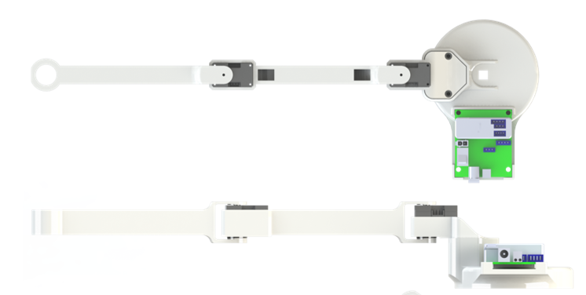
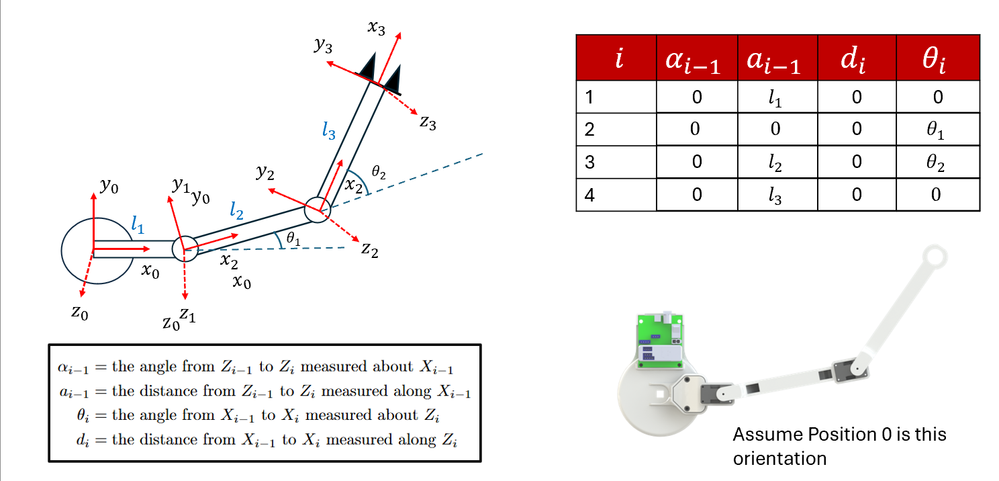
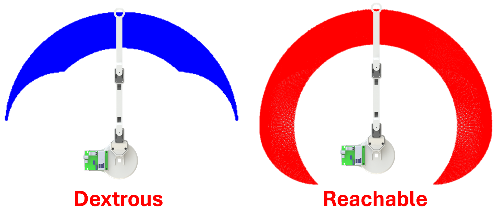

# 2-DOF RuG Manipulator – Web Control & Tuning Interface

This repository contains a browser-based control and tuning interface for the **2-DOF RuG Manipulator**: a planar arm driven by two Dynamixel XC330-M288-T or XL330-M288-T servos.

The webapp lets you:

- Scan and connect to Dynamixel servos.
- Change operating modes (current, velocity, position, extended position).
- Tune PID gains and send motion setpoints.
- Monitor **live telemetry** (position, velocity, current, PWM) with scrolling plots.
- Draw a path in an **inverse kinematics (IK) canvas** and let the real arm follow it.

## 1. System overview

### Hardware

- 2× **Dynamixel XC330-M288-T** servos (serially chained on the same bus)
- Dynamixel interface (**U2D2**)
- External power supply for the servos 
- Host PC running Python + web browser (Raspberry PI 4 or 5)

> **2-DOF RuG Manipulator**  
> A planar 2-link arm with revolute joints and link lengths \(l_1, l_2\).

### Kinematic model

The controller uses a simple 2-link planar model, expressed via the following DH table:

| i | αᵢ₋₁ | aᵢ₋₁ | dᵢ | θᵢ |
|---|------|------|----|----|
| 1 | 0    | 0    | 0  | θ₁ |
| 2 | 0    | l₁   | 0  | θ₂ |
| 3 | 0    | l₂   | 0  | 0  |

This gives the standard 2-R planar forward kinematics:

- Joint between links:  
  \( x_1 = l_1 \cos\theta_1,\quad y_1 = l_1 \sin\theta_1 \)
- End-effector:  
  \( x_e = x_1 + l_2 \cos(\theta_1 + \theta_2) \)  
  \( y_e = y_1 + l_2 \sin(\theta_1 + \theta_2) \)

The IK uses the analytical 2-R solution with an **elbow-up / elbow-down** option and joint limits:

- θ₁ ∈ [−90°, +90°]  
- θ₂ ∈ [−90°, +90°]

These limits are used both for the real robot motions and for shading the reachable workspace in the IK drawing canvas.

- Devloped by Damien Dufour
- For Questions, contact damidufo@gmail.com

